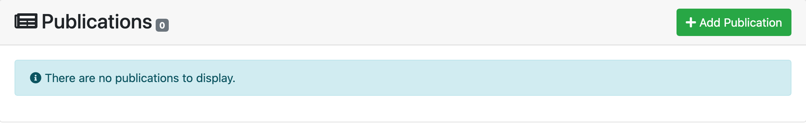
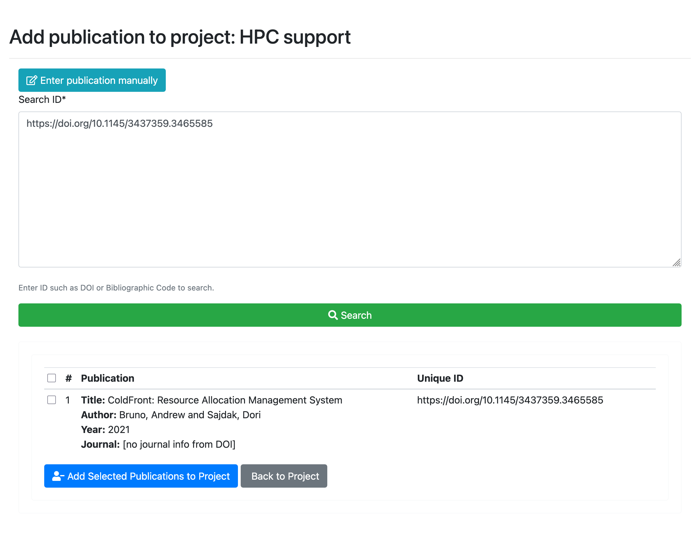
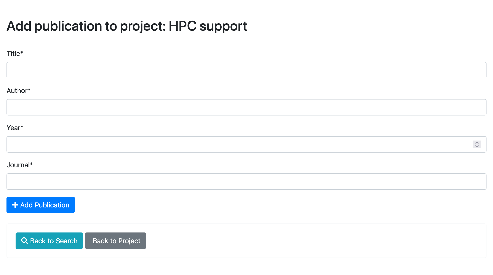
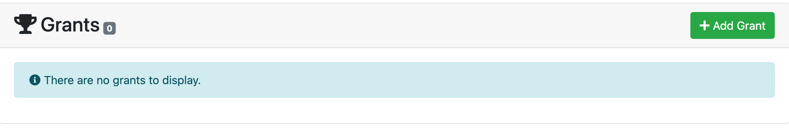
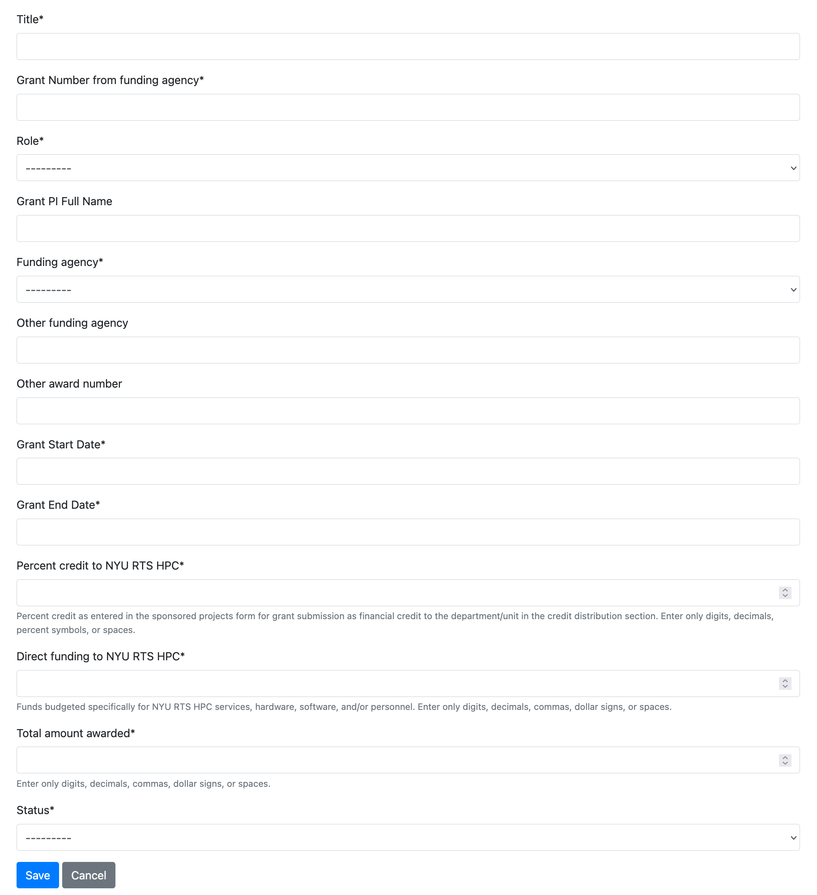

# Entering Grants and Publciations for Your Project

## Acknowledgment Statement for Publications
The following acknowledgment statement should appear in the publication of any material that resulted from using the NYU IT HPC resources, services, and staff expertise.

*"This work was supported in part through the NYU IT High Performance Computing resources, services, and staff expertise"*

Please also enter your publications and grants following the steps below. For non-publications, such as presentations or conference posted, please let the NYU HPC team know of your work via email to hpc@nyu.edu. 

:::info[VPN Needed]
You need to be connected to [NYU VPN](https://www.nyu.edu/life/information-technology/infrastructure/network-services/vpn.html) to access the HPC project management portal.
:::

PIs and project managers are able to add publications that result from the use of HPC resources and the grants that enable you to use the HPC resource. This data helps us offer better HPC services to you and we kindly request that you do not ignore notifications for this.

## Enter Publications

Publications can be added to a project by the PI or manager.  Publications can be uploaded using a DOI number or they can be entered in manually.  PIs and managers can remove publications they no longer wish to have on their project and export the full list or a selection of the publications to a CSV file.  Center directors and system administrators are able to access the list of all publications added in ColdFront.  The Center Summary contains summary information about the publications and is available to logged in as well as non-authenticated users.

### Adding Publications Using DOI Search

You can find the 'Add Publication' button on the project page:

Enter the DOI number(s) in the search box and click the Search button. Multiple DOIs should be entered on separate lines.

  

To add the publication found, click the checkbox and then the "Add Selected Publications to Project" button.

### Adding Publications Manually

After clicking the 'Add Publication' button on the Project Detail page, click the 'Enter publication manually' The PI/manager can then enter basic details about the publication: title, author, year, and journal name. These fields are all required. Once complete, click the 'Add Publication' button to add to the project.

## Enter Grants

Grant data is useful to Center Directors for making the case for enabling science at an organization. How much funding is your organization able to obtain based on having access to your center's HPC resources? You may ask your PIs to enter all grants they have been awarded or only those for which they need your center's resources. This is a policy decision and should be communicated to your researchers.  

### Adding Grants

You can find the 'Add Grant' button on the project page:

PIs or managers must supply the fields marked with an asterisk:

