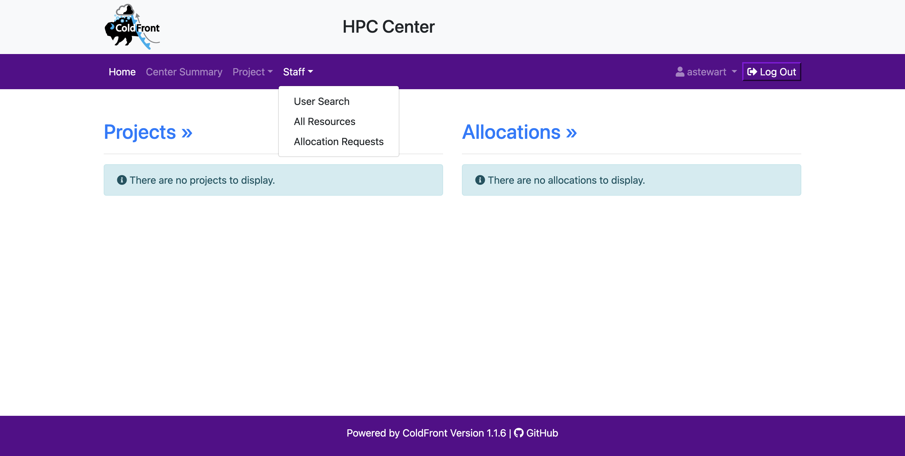
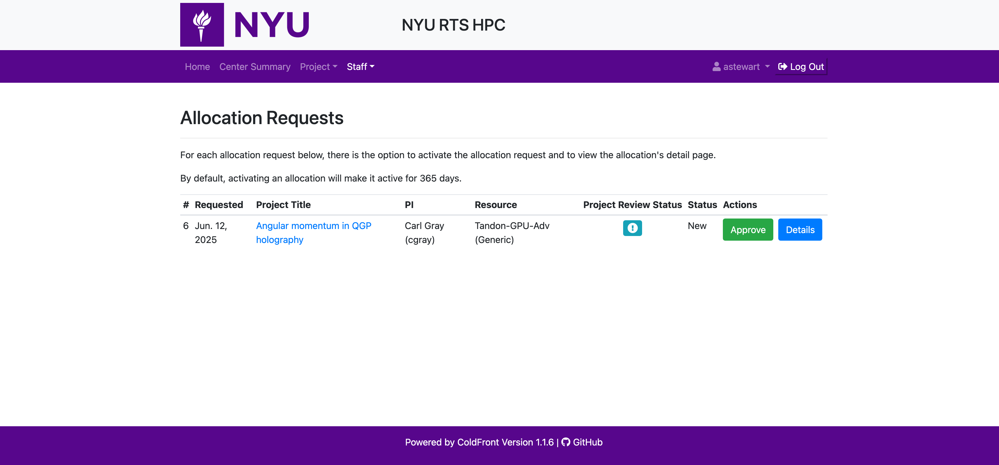
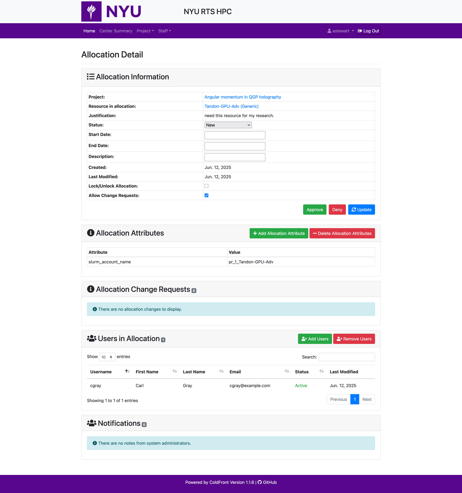
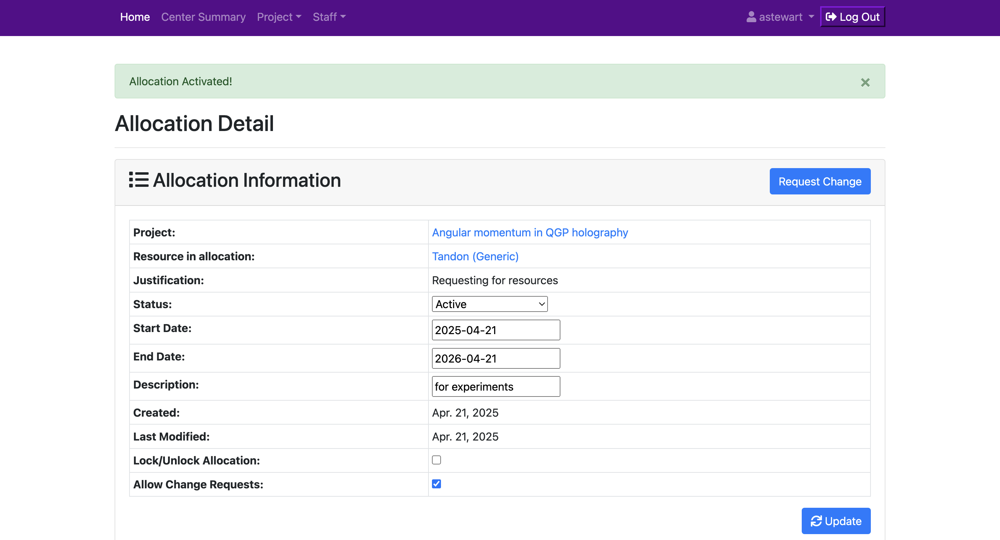
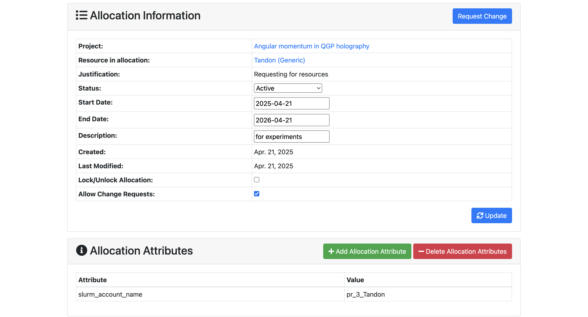

# How to approve an allocation request

:::info[VPN Needed]
You need to be connected to the NYU VPN to access the  HPC project management portal.
:::

If you are an approver for your school, first login to the HPC projects portal page and you'll see "staff" in the navigation bar.
Click the "staff" navigation bar and click "Allocation Requests" to see a list of requests waiting for your approval.

Now, you'll see a list of allocation requests. Click "Details" button for the request that you would like to approve. 
You should click "Details" instead of just "Approve" button if you'd like to set more details.

After clicking "Details", you'll see Allocation information part to fill in with your approval.
Here, you could set start date, end date, description, etc.
If you're done with adding the information, you could click "Update" button to update the allocation request with the information you put.

After clicking "Update", the allocation request is approved, and the allocation is activated now!

Slurm account name is also available on the allocation attributes if you need it.

If you have any difficulties or questions, please contact us at hpc@nyu.edu.

