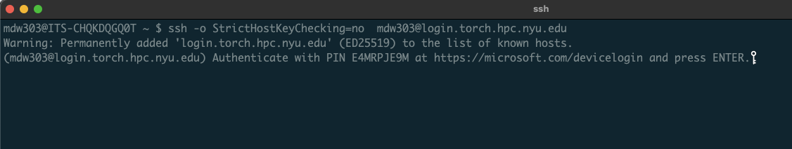
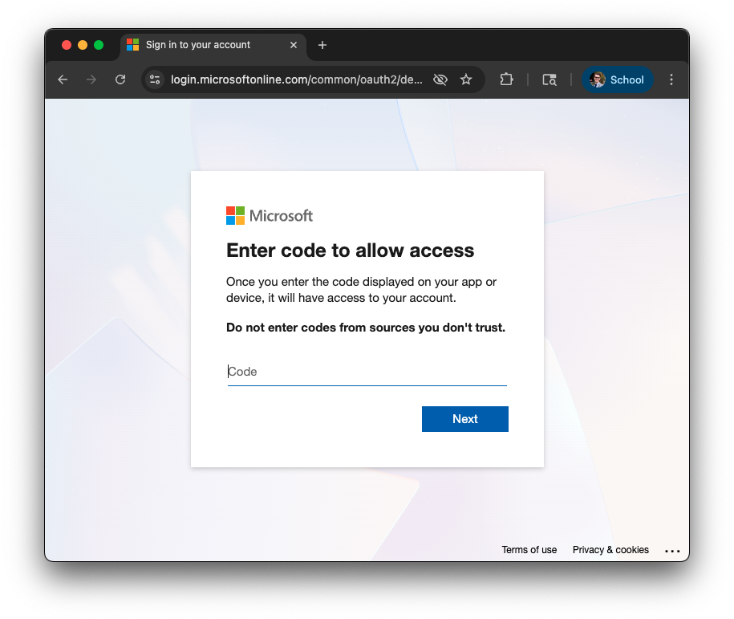
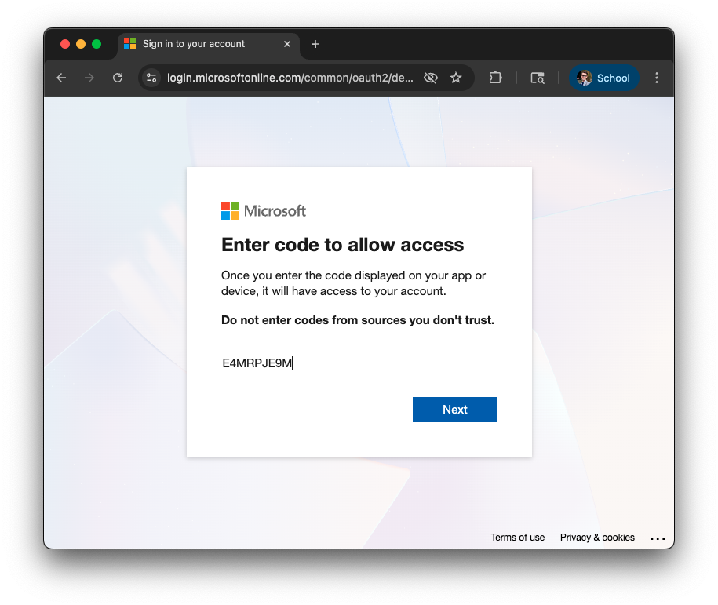
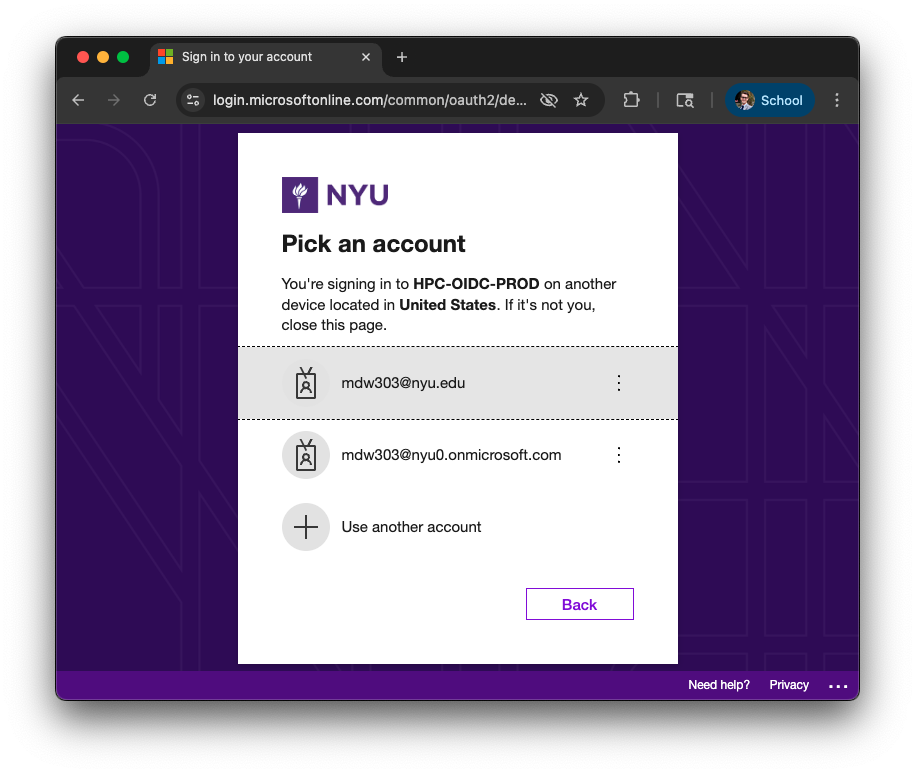
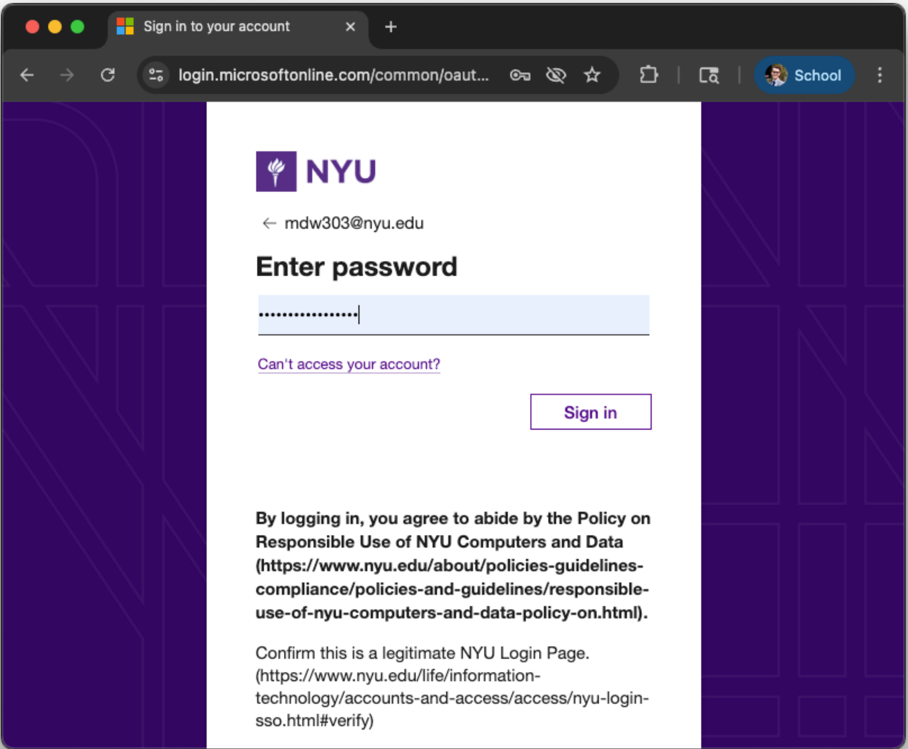
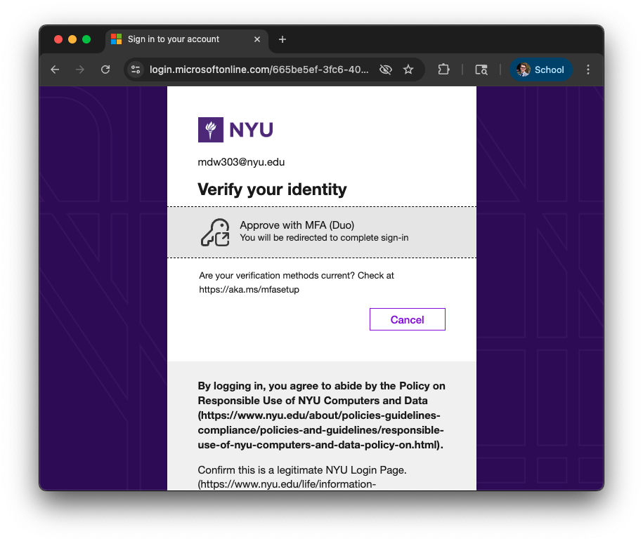
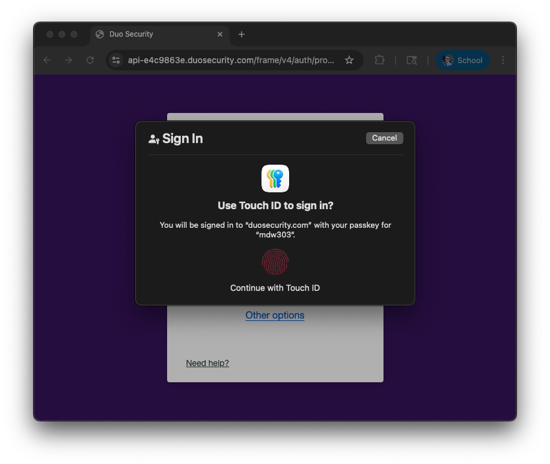
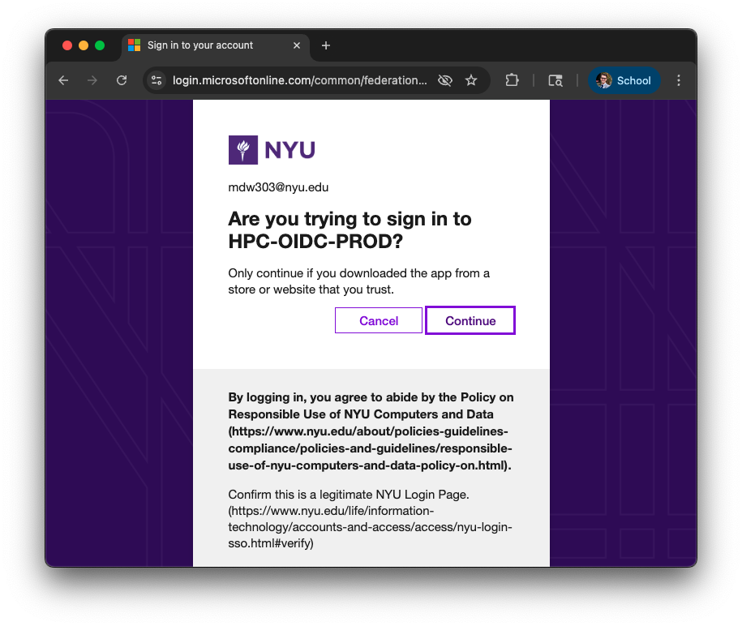
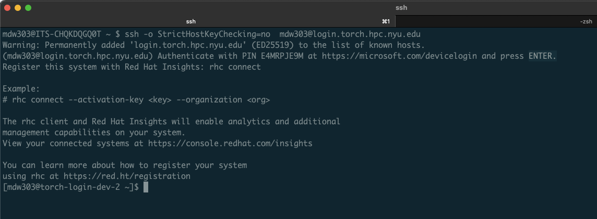

# Connecting to the HPC Cluster

:::tip
This page gives an overview of connecting to the HPC cluster, for a tutorial on this topic, head to the [this section](../12_tutorial_intro_shell_hpc/02_connecting_to_hpc.mdx)! 
:::

There are several ways to interact with the Greene HPC cluster. Similar to other Linux clusters, the most common method of connection is via a Command Line Interface (CLI). A CLI is a program that allows you to create and delete files, run programs, and navigate through directories and files via a typed prompt. On Mac, the built-in CLI application is called Terminal. While Windows 11 machines support a Linux Subsystem, which allows for similar functionality, a popular tool used to connect to a Linux server is a free application called [MoabXterm](https://mobaxterm.mobatek.net/documentation.html) 

:::tip
If you'd prefer to access the HPC cluster via a web gateway instead, please refer to [the section describing Open OnDemand (OOD)](../09_ood/01_ood_intro.md).
:::

The following sections will outline basic ways to connect to the Greene cluster. Access to the clusters is primarily handled via the Secure Shell Protocol, or ssh. Below we outline ways to connect via ssh on Mac, Linux, and Windows machines.

## Configuring Your SSH Client

To connect to HPC systems, you have to configure the SSH client on your machine. We recommend the following configuration:
```sh
Host dtn.hpc.nyu.edu
  User <NetID>
  StrictHostKeyChecking no
  ServerAliveInterval 60
  ForwardAgent yes
  UserKnownHostsFile /dev/null
  LogLevel ERROR

Host torch login.torch.hpc.nyu.edu
  Hostname login.torch.hpc.nyu.edu
  User <NetID>
  StrictHostKeyChecking no
  ServerAliveInterval 60
  ForwardAgent yes
  UserKnownHostsFile /dev/null
  LogLevel ERROR
```
### MacOS/Linux

MacOS/Linux machines have SSH clients pre-installed. Using the editor of your choice, open the `~/.ssh/config` file on your machine and add the contents listed above.

### Windows
Using Powershell you can use the following to create and open a Windows SSH config file:
```sh
# Create the config file with Powershell
New-Item -Path $HOME\.ssh\config -ItemType File

# Open config File with Notepad
C:\WINDOWS\System32\notepad.exe $HOME\.ssh\config
```
Configuring the file above will allow you to use the cmd terminal to connect to Greene.

### Common issues

:::warning Man in the Middle warning
If you see this warning:
```sh
@@@@@@@@@@@@@@@@@@@@@@@@@@@@@@@@@@@@@@@@@@@@@@@@@@@@@@@@@@@
@    WARNING: REMOTE HOST IDENTIFICATION HAS CHANGED!     @
@@@@@@@@@@@@@@@@@@@@@@@@@@@@@@@@@@@@@@@@@@@@@@@@@@@@@@@@@@@
IT IS POSSIBLE THAT SOMEONE IS DOING SOMETHING NASTY!
Someone could be eavesdropping on you right now (man-in-the-middle attack)!
It is also possible that a host key has just been changed.
```
Do not be alarmed - this is an issue that occurs because the Greene and Torch clusters have multiple login nodes. For instance, `login.torch.hpc.nyu.edu` resolves to one of three possible login nodes (`log-1`, `log-2`, and `log-3`). The configuration directive `StrictHostKeyChecking no` referenced in the recommended config above will prevent this error. Ensure that you have not missed adding it.
:::

:::info SSH Timeout errors
SSH timeout errors can be fixed by extending the `ServerAliveInterval` argument.
:::

## Connecting to the NYU Network
To access the HPC systems, you must either be on the NYU secure network (such as the NYU WiFi or a wired connection from an NYU office) or use the NYU VPN.

:::info Connecting to the HPC clusters from outside NYU Network
[Set up your computer to use the NYU VPN][nyu vpn link]. Once you've created a VPN connection, you can proceed as if you were connected to the NYU net
:::

## Command Line Interface (with a Terminal)

### Mac & Linux Access

Once you're on the VPN or the main NYU network on campus you can SSH directly to torch like so:

```sh
ssh <Your NetID>@login.torch.hpc.nyu.edu
```
 
### Windows

#### Powershell
You can access the ssh client via Powershell, either by installing [Windows Terminal](https://apps.microsoft.com/detail/9n0dx20hk701?hl=en-US&gl=US) or [Powershell](https://learn.microsoft.com/en-us/powershell/scripting/install/installing-powershell-on-windows) directly. With powershell, you would log into the HPC systems the same way as with a Linux terminal.

#### Windows WSL2

Alternatively, you can install WSL2, and then install Ubuntu or other Linux distribution (for example, from Microsoft Store). You will have a fully functional Ubuntu with terminal and can connect to cluster using instructions provided above for Linux/Mac users. Instructions on WSL installation can be found here: [https://docs.microsoft.com/en-us/windows/wsl/install-win10][wsl installation link]

With [Windowns Terminal](https://apps.microsoft.com/detail/9n0dx20hk701?hl=en-US&gl=US), you can access both the Linux WSL2 shell and the Windows Powershell from the same application.
 
:::tip
-   If you are using WSL 2 (Windows subsystem for Linux 2), you may not be able to access internet when Cisco AnyConnect VPN, installed from exe file, is activated. A potential solution: uninstall Cisco AnyConnect and install AnyConnect using Microsoft Store, and then setup new VPN connection using settings described on [IT webpage][install vpn on windows link].
:::

## Two-factor authentication for Torch
There is an extra layer of security when accessing Torch which is described below:

-   Login as usual via the `ssh torch` command:
 
-   Open [https://microsoft.com/devicelogin](https://microsoft.com/devicelogin)

-   Copy and enter pin from terminal

-   Enter or select your `<NetID>@nyu.edu` account

-   Enter your password

-   Complete MFA (click on Approve with MFA (Duo)



-   Return to terminal and hit Enter


## SSH Keys for Greene
:::warning
SSH keys are not supported on Torch!
:::

Instead of typing your password every time you need to log in, you can also specify an ssh key.

-   Only do that on the computer you trust
-   Generate ssh key pair (terminal in Linux/Mac or cmd/WSL in Windows) [using ssh keygen](https://www.ssh.com/ssh/keygen/)
-   Note the path to ssh key files. Don't share key files with anybody - anybody with this key file can login to your account
-   Log into cluster using regular login/password and then add the content of generated public key file (the one with .pub) to `$HOME/.ssh/authorized_keys` on cluster
-   Next time you will log into cluster no password will be required


[nyu vpn link]: https://www.nyu.edu/life/information-technology/infrastructure/network-services/vpn.html

[install vpn on windows link]: https://nyu.service-now.com/sp?sys_kb_id=6177d7031c811904bbcf4dc2835ec340&id=kb_article_view&sysparm_rank=3&sysparm_tsqueryId=9a07fee81b146410a54ffdd51a4bcb8e

[wsl installation link]: https://docs.microsoft.com/en-us/windows/wsl/install-win10
