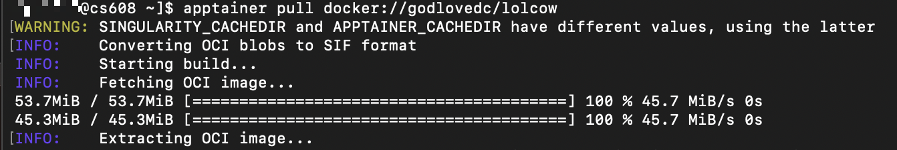
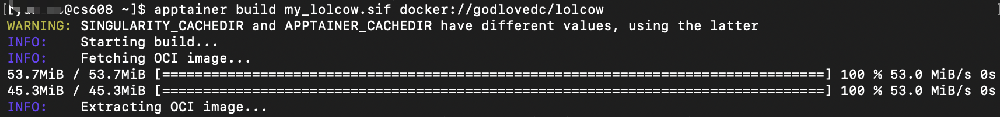
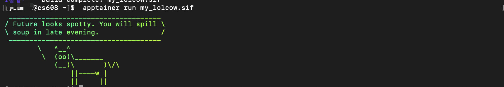
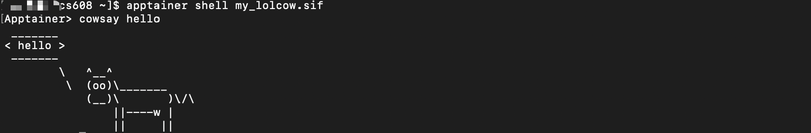

# Custom Applications with Containers

## What is Apptainer?
Apptainer is a container based Linux kernel workspace that works just like Docker. You can run pre-built programs in containers without having to worry about the pre-install environment. You can even run Docker containers with Apptainer. Please see the [Apptainer and Docker](https://apptainer.org/docs/user/main/docker_and_oci.html) documentation by Syslabs for details about all the ways Apptainer supports Docker. For a detailed introduction on Apptainer, visit their [official site](https://apptainer.org/documentation/).

Apptainer is the continuation of the Singularity project. When we transition to the new Torch cluster you will only see reference to Apptainer.  The reason for this is that there were two container projects with the name Singularity. The original free and open-source (FOSS) project and a closed-source corporate fork.  The FOSS version has renamed itself to Apptainer to avoid confusion and this is the version we use.

## Why Do We Use Apptainer
There are multiple reasons to use Apptainer on the HPC clusters:
-   **Security**: Apptainer provides a layer of security as it does not require any root access on our clusters. This makes it safer against malware and bad scripts that might jeopardize the outer system. Thus we only support Apptainer on our clusters (there are not other options such as Kubernetes or Docker on our clusters right now).
-   **Containerization**: Apptainer will run all your images (packaged and prebuilt programs) inside of its containers, each container works like a small vm. They contain all the required environment and files of a single Linux kernel and you don't have to worry about any pre-installation issues.
-   **Inter-connectivity**: Containers are able to talk to each other, as well as the home system, so while each container has its own small space, they are still a part of a big interconnected structure. Thus enabling you to connect your programs.
-   **Accessibility**: Probably the most important feature of all, Apptainer allows you to run your program in 2 to 3 simple steps, as shown below. 

## How to Run an Apptainer Container
There are 3 steps to run an Apptainer container on our clusters:

:::warning
Running containers on login nodes is not encouraged, as processes may be terminated due to resource limits; please use compute nodes instead.
:::

### 1. Pull an Image from Docker Hub
```sh
$ apptainer pull docker://godlovedc/lolcow
# image name can be for example docker://godlovedc/lolcow
```



### 2. Build the Image (Optional)
```sh
$ apptainer build <a name of your choosing>.sif <image name>
# the image name can be a local image or an image from a hub
```

Building an image is optional for most use cases. In many cases, users can directly run containers pulled from Docker Hub without building a local image.



You can now run your container using the built image.

### 3. Run Container
```sh
# this is one way of running a container
$ apptainer run <image name>.sif
# this is another way to run a container
$ ./<image name>.sif
```

:::info
Apptainer images are immutable by default. You can mount an writable overlay file and edit files within the overlay.
:::

running this would yield a menu for output:



#### Enter Container
```sh
apptainer shell <image name>.sif
# after this step, you will be going into the container and start your programming
```



:::tip

Run commands outside the container

You can run commands for the container using exec arguments without actually going into the container

```sh
$ apptainer exec <image name>.sif <commands>
# adding commands to the back will return the display result of these commands in the container without actually going into the container
```
:::

### Using `fakeroot`

In some cases, you may need elevated permissions inside the container to install software or modify system files. Apptainer provides a `--fakeroot` option that allows you to run commands inside the container with root-like privileges, without requiring actual root access on the system.

```sh
$ apptainer exec --fakeroot <image name>.sif <commands>
```

That's it! Now you're good to go and can just use these simple steps to run Apptainer images and run your programs.

For full information and documentation please visit [Apptainer](https://apptainer.org/).

## How to Create an Apptainer Container
So what if you want to create an image from your container and save it for a rainy day?

Apptainer documentation has [instructions for building containers](https://apptainer.org/docs/user/latest/build_a_container.html) for your convenience.  Please read through them to create your own Apptainer container and package it into an image!

Similarly, you can build docker containers using the information from [Docker's documentation](https://docs.docker.com/get-started/docker-concepts/building-images/). You can then upload them onto docker hub and pull them using Apptainer. Apptainer supports all Docker images!

## Apptainer vs Docker
Why are there so many mentions of Docker? The reason is that Apptainer is essentially compatible with Docker and you don't need to relearn Apptainer if you already have experience with Docker. Now let's get into some pros and cons between the two programs.
-   Docker is more accepted commercially than Apptainer. You can download and run Docker on your own computer with any operating system and build containers with ease while Apptainer is used in a more academic setting. Apptainer primarily supports Linux environments and is designed for HPC use cases.
-   However, Docker requires root or admin access for the operating system it deploys on, and our clusters do not offer that access to any software that requires this criteria. Thus Docker is not available on the clusters and Apptainer is.
-   A silver lining in all of this is that Apptainer fully supports Docker images and you can do everything in Docker and push your image to Docker Hub and pull them on the clusters. Thus making sure that you don't need to relearn workflows and can just use it through the simplest of commands in this documentation.

Good luck with Apptainer, and have fun!
