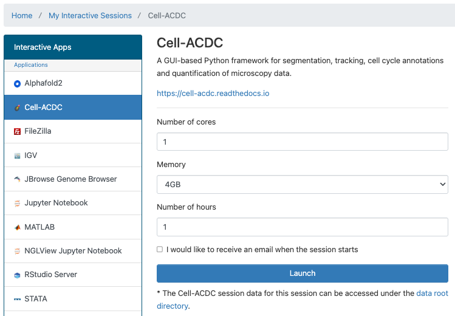
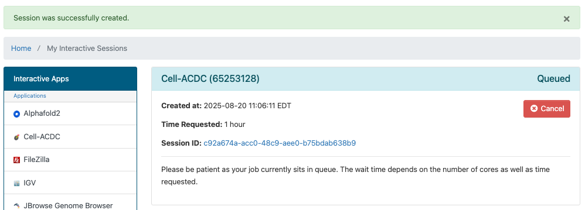
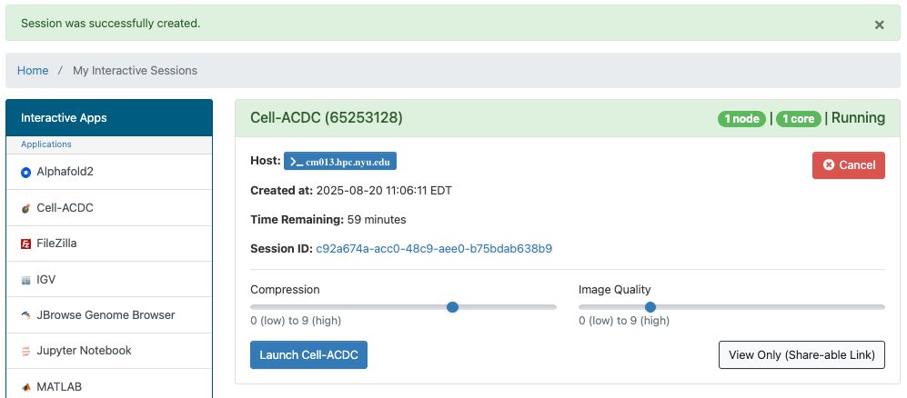

# Cell-ACDC in OOD

[Cell-ACDC](https://cell-acdc.readthedocs.io) is a GUI-based Python framework for segmentation, tracking, cell cycle annotations and quantification of microscopy data.

## Getting Started
You can run Cell-ACDC in OOD by going to the URL [ood.torch.hpc.nyu.edu](http://ood.torch.hpc.nyu.edu) in your browser and selecting `Cell-ACDC` from the `Interactive Apps` pull-down menu at the top of the page.  Once you've used it and other interactive apps they'll show up on your home screen under the `Recently Used Apps` header.

:::note
Be aware that when you start from `Recently Used Apps` it will start with the same configuration that you used previously.  If you'd like to configure your Cell-ACDC session differently, you'll need to select it from the menu.
:::

## Configuration

You can select the number of cores, amount of memory, and number of hours.

## Cell-ACDC running in OOD

After you hit the `Launch` button you'll have to wait for the scheduler to find node(s) for you to run on:

Then you'll have a short wait for the Cell-ACDC itself to start up. 
Once that happens you'll get one last page that will give you links to:
-   open a terminal window on the compute node your Cell-ACDC session is running on
-   go to the directory associated with your Session ID that stores output, config and other related files for your session
-   make changes to compression and image qualtiy
-   get a link that you can share that will allow others to view your Cell-ACDC session

Please click the `Launch Cell-ACDC` button and a Cell-ACDC window will open.
