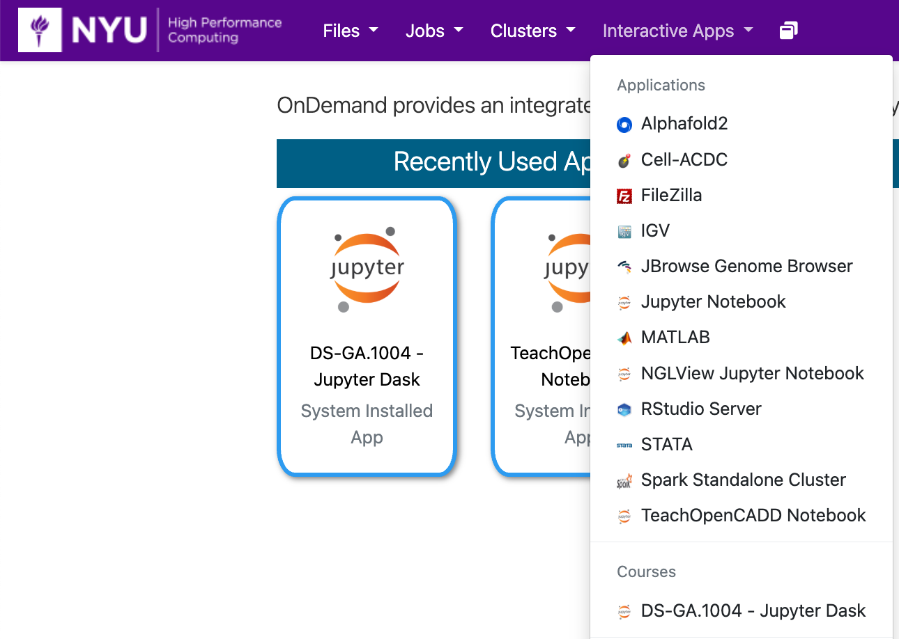
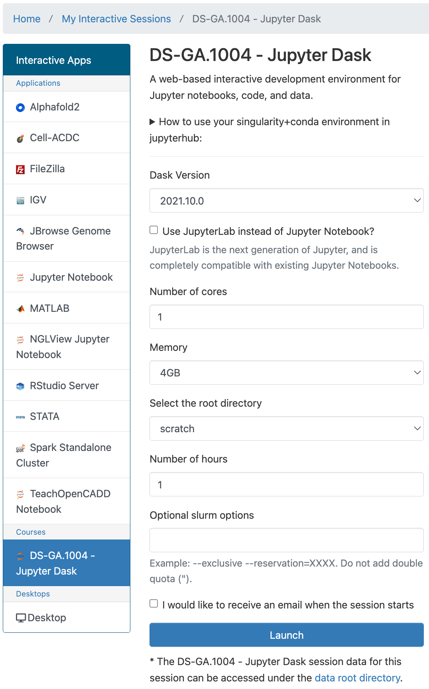
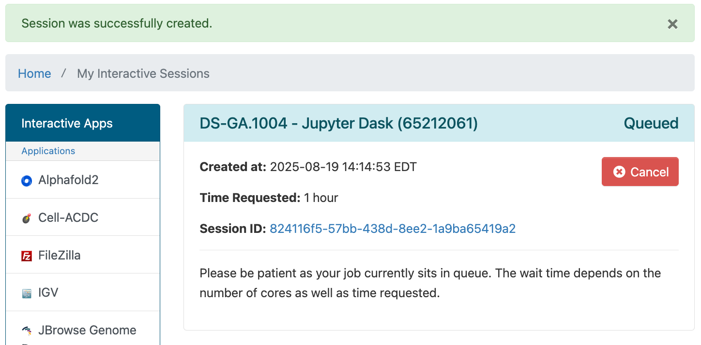
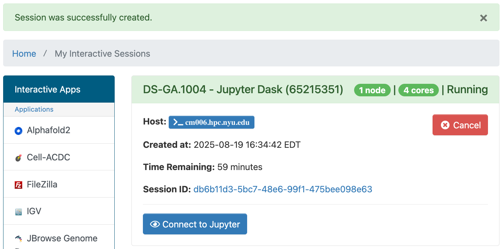

# Dask in Jupyter Notebook in OOD

[Dask](https://docs.dask.org/en/stable/) is a Python library for parallel and distributed computing.

## Getting Started
You can run Dask in a Jupyter Notebook in OOD by going to the URL [ood.hpc.nyu.edu](http://ood.hpc.nyu.edu) in your browser and selecting `DS-GA.1004 - Jupyter Dask` from the `Interactive Apps` pull-down menu at the top of the page.  As you can see below, once you've used it and other interactive apps they'll show up on your home screen under the `Recently Used Apps` header.

:::note
Be aware that when you start from `Recently Used Apps` it will start with the same configuration that you used previously.  If you'd like to configure your Dask session differently, you'll need to select it from the menu.
:::



## Configuration

You can select the Dask version, number of cores, amount of memory, root directory, number of hours, and optional Slurm options.



:::warning
If you select to use `/home` as your root directory be careful not to go over your quota.  You can find your current usage with the `myquota` command.  Please see our [Storage documentation](../03_storage/01_intro_and_data_management.mdx) for details about your storage options.
:::

## Dask with Jupyter Notebook running in OOD

After you hit the `Launch` button you'll have to wait for the scheduler to find node(s) for you to run on:


Then you'll have a short wait for Dask itself to start up.<br />
Once that happens you'll get one last page that will give you links to:
-   open a terminal window on the compute node your Dask session is running on
-   go to the directory associated with your Session ID that stores output, config and other related files for your session



Please click the `Connect to Jupyter` button and a Jupyter window will open.

## Dask Example

Start a new Jupyter notebook with 4 cores, 16GB memory, and set your root directory to `/scratch`.  Enter the following code in the first cell and execute it by pressing the `Shift` and `Enter` keys at the same time.
```python
import os
import pandas as pd
import numpy as np
import time

# Create a directory for the large files
output_dir = "tmp/large_data_files"
os.makedirs(output_dir, exist_ok=True)

num_files = 5  # Number of files to create
rows_per_file = 10_000_000  # 10 million rows per file
for i in range(num_files):
    data = {
        'col1': np.random.randint(0, 100, size=rows_per_file),
        'value': np.random.rand(rows_per_file) * 100
    }
    df = pd.DataFrame(data)
    df.to_csv(os.path.join(output_dir, f'data_{i}.csv'), index=False)
print(f"{num_files} large CSV files created in '{output_dir}'.")

import dask.dataframe as dd
from dask.distributed import Client
import time
import os

# Start a Dask client for distributed processing (optional but recommended)
# This allows you to monitor the computation with the Dask dashboard
client = Client(n_workers=4, threads_per_worker=2, memory_limit='16GB') # Adjust these as per your system resources
print(client)

# Load multiple CSV files into a Dask DataFrame
# Dask will automatically partition and parallelize the reading of these files
output_dir = '/scratch/rjy1/tmp/large_data_files'
dask_df = dd.read_csv(os.path.join(output_dir, 'data_*.csv'))

# Perform a calculation (e.g., calculate the mean of the 'value' column)
# This operation will be parallelized across the available workers
result_dask = dask_df['value'].mean()

# Trigger the computation and measure the time
start_time = time.time()
computed_result_dask = result_dask.compute()
end_time = time.time()

print(f"Dask took {end_time - start_time} seconds to compute the mean across {num_files} files.")
print(f"Result (Dask): {computed_result_dask}")

import pandas as pd
import time
import os

# Perform the same calculation sequentially with Pandas
start_time_pandas = time.time()
total_mean = 0
total_count = 0
for i in range(num_files):
    df = pd.read_csv(os.path.join(output_dir, f'data_{i}.csv'))
    total_mean += df['value'].sum()
    total_count += len(df)
computed_result_pandas = total_mean / total_count
end_time_pandas = time.time()

print(f"Pandas took {end_time_pandas - start_time_pandas} seconds to compute the mean across {num_files} files.")
print(f"Result (Pandas): {computed_result_pandas}")
```
You should get output like:
```
5 large CSV files created in 'tmp/large_data_files'.
<Client: 'tcp://127.0.0.1:45511' processes=4 threads=8, memory=59.60 GiB>
Dask took 3.448112726211548 seconds to compute the mean across 5 files.
Result (Dask): 50.010815178612596
Pandas took 9.641847610473633 seconds to compute the mean across 5 files.
Result (Pandas): 50.01081517861258
```