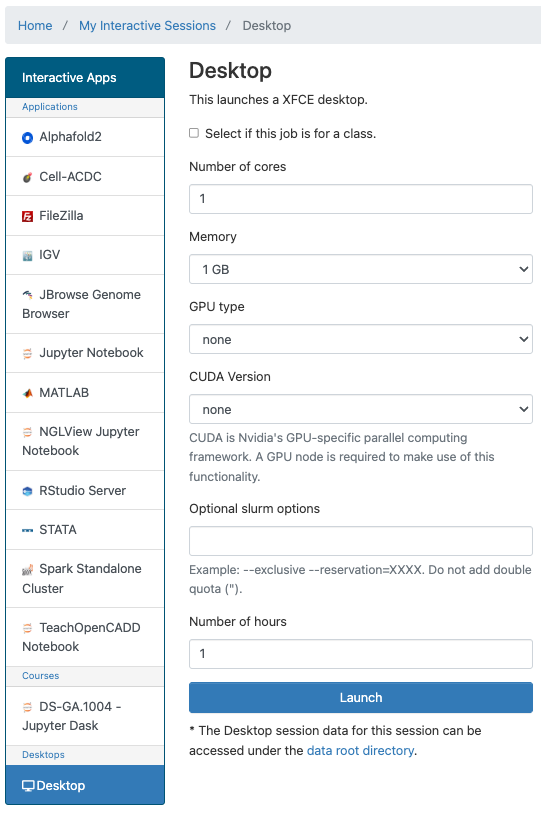
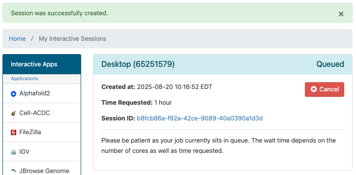
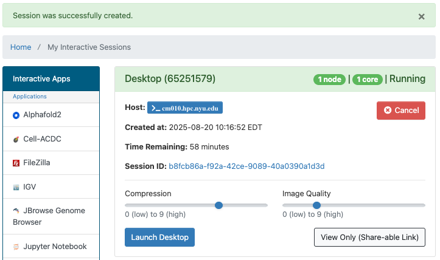

# Desktop in OOD

You can get a basic desktop interface to HPC resources.

## Getting Started
You can get a desktop in OOD by going to the URL [ood.hpc.nyu.edu](http://ood.hpc.nyu.edu) in your browser and selecting `Desktop` from the `Interactive Apps` pull-down menu at the top of the page.  As you can see below, once you've used it and other interactive apps they'll show up on your home screen under the `Recently Used Apps` header.

:::note
Be aware that when you start from `Recently Used Apps` it will start with the same configuration that you used previously.  If you'd like to configure your Desktop session differently, you'll need to select it from the menu.
:::

## Configuration

You can select the number of cores, amount of memory, GPU type (if any), number of hours, and optional Slurm options.

## Desktop running in OOD

After you hit the `Launch` button you'll have to wait for the scheduler to find node(s)for you to run on:

Then you'll have a short wait for the Desktop itself to start up. 
Once that happens you'll get one last page that will give you links to:
-   open a terminal window on the compute node your Desktop session is running on
-   go to the directory associated with your Session ID that stores output, config and other related files for your session
-   make changes to compression and image qualtiy
-   get a link that you can share that will allow others to view your Desktop session

Please click the `Launch Desktop` button and a Desktop window will open.