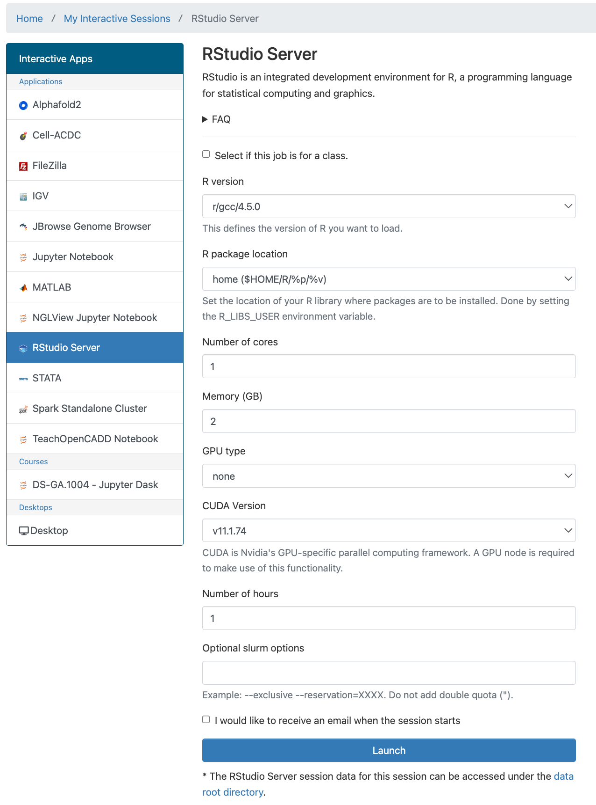
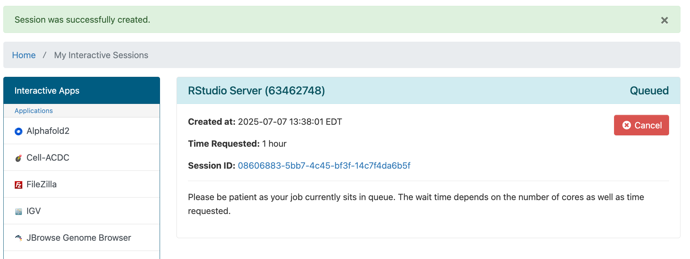

# RStudio in OOD

## Getting Started
You can run RStudio in OOD by going to the URL [ood.hpc.nyu.edu](http://ood.hpc.nyu.edu) in your browser and selecting `RStudio Server` from the `Interactive Apps` pull-down menu at the top of the page.  As you can see below, once you've used it and other interactive apps they'll show up on your home screen under the `Recently Used Apps` header.

:::note
Be aware that when you start from `Recently Used Apps` it will start with the same configuration that you used previously.  If you'd like to configure your RStudio session differently, you'll need to select it from the menu.
:::

## Configuration

You can select the version of R to use, the R package location, the number or cores, amount of memory, GPU type (if any), amount of time, and optional Slurm options.

::::tip
You may wish to set the 'R Package Location' to `/scratch` since space in `/home` is limited.
Also, be aware that when RStudio always starts in your `/home/NetID` directory.
:::warning
Be careful not to go over your quota for `/home`.  You can find your current usage with the `myquota` command.  Please see [our Storage documentation](../03_storage/01_intro_and_data_management.mdx) for details about your storage options.
:::
::::

## RStudio Running in OOD

After you hit the `Launch` button you'll have to wait for the scheduler to find you node(s) to run on:

Then you'll have a short wait for RStudio itself to start up. 

Then after you hit the `Connect to RStudio Server` button you'll have the familar RStudio Desktop to use.

