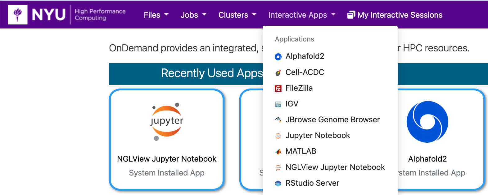
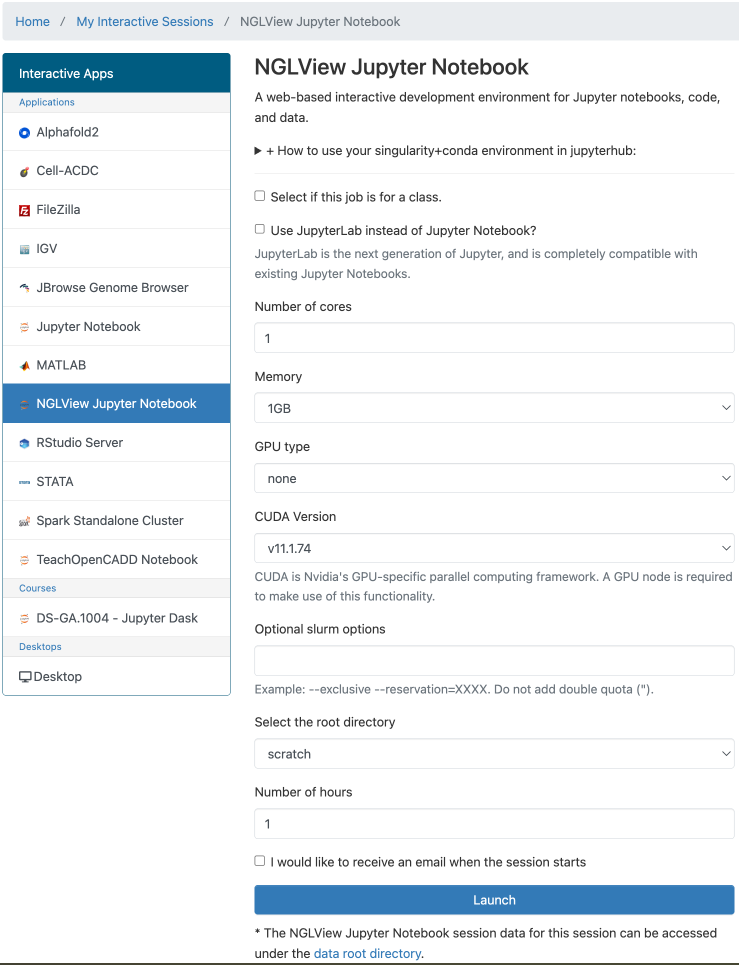
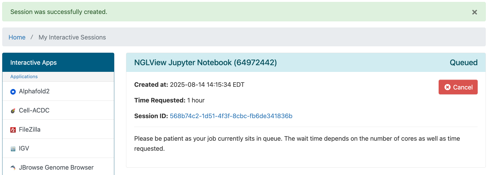
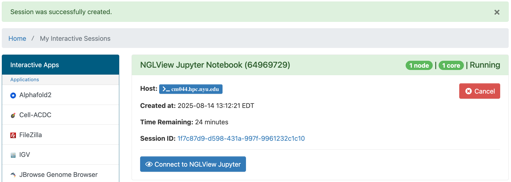
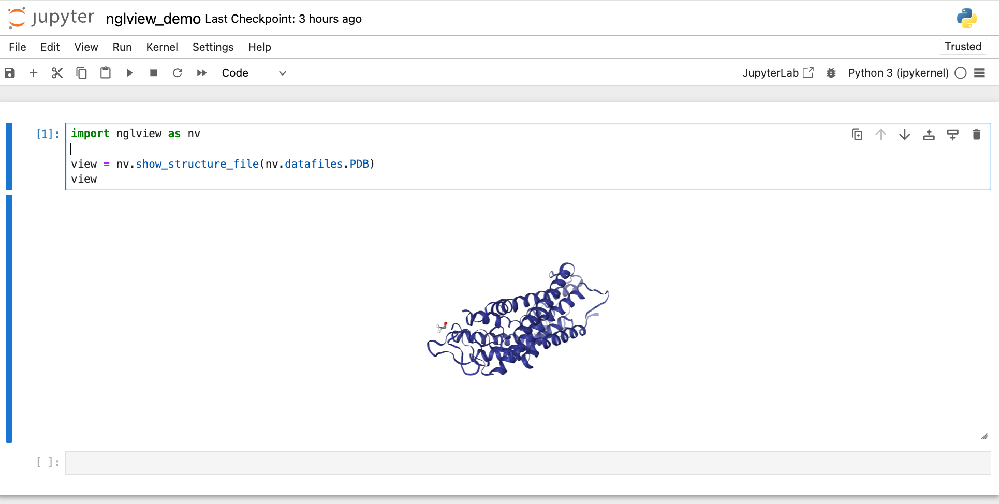

# NGLView Jupyter Notebook in OOD

## Getting Started
You can run NGLView in a Jupyter Notebook in OOD by going to the URL [ood.hpc.nyu.edu](http://ood.hpc.nyu.edu) in your browser and selecting `NGLView Jupyter Notebook` from the `Interactive Apps` pull-down menu at the top of the page.  As you can see below, once you've used it and other interactive apps they'll show up on your home screen under the `Recently Used Apps` header.

:::note
Be aware that when you start from `Recently Used Apps` it will start with the same configuration that you used previously.  If you'd like to configure your NGLView Jupyter Notebook session differently, you'll need to select it from the menu.
:::



## Configuration

You can select the number or cores, amount of memory, GPU type (if any) and CUDA version, amount of time, optional Slurm options, and the root directory.



:::warning
If you select home as the root directory, be careful not to go over your quota.  You can find your current usage with the `myquota` command.  Please see our [Storage documentation](../03_storage/01_intro_and_data_management.mdx) for details about your storage options.
:::

## NGLView Jupyter Notebook running in OOD

After you hit the `Launch` button you'll have to wait for the scheduler to find you node(s) to run on:


Then you'll have a short wait for the Jupyter Notebook itself to start up.<br />
Once that happens you'll get one last form that will allow you to:
-   open a terminal window on the compute node your NGLView Jupyter Notebook session is running on
-   go to the directory associated with your Session ID that stores output, config and other related files for your session



Then after you hit the `Connect to NGLView Jupyter` button you'll be able to use NGLView commands in a Jupyter Notebook.

### NGLView Jupyter Notebook example

Please enter the following into the first Jupyter Notebook cell and run it by hitting `shift`+`enter`:
```python
import nglview as nv
view = nv.show_structure_file(nv.datafiles.PDB)
view
```

You should get output like this:

