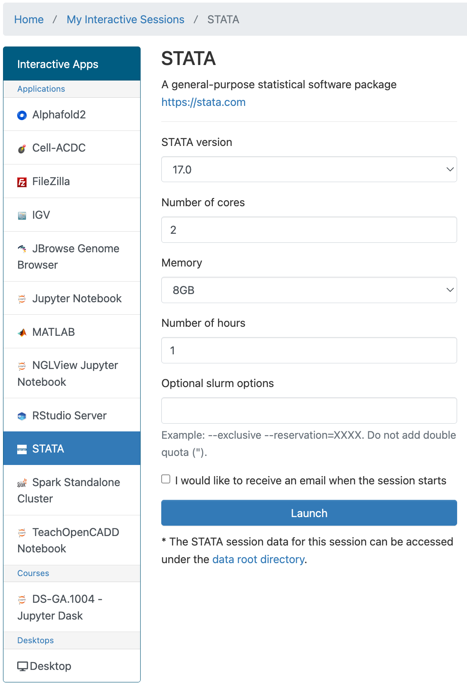
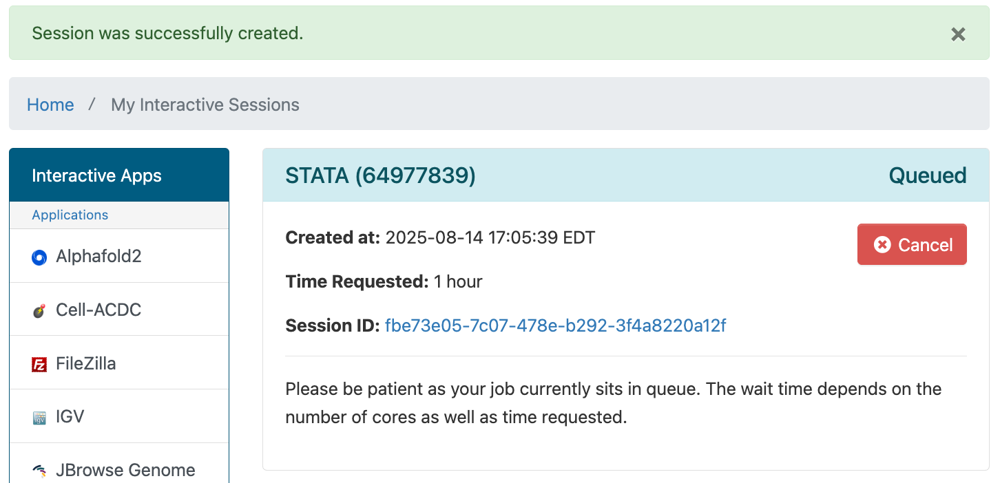
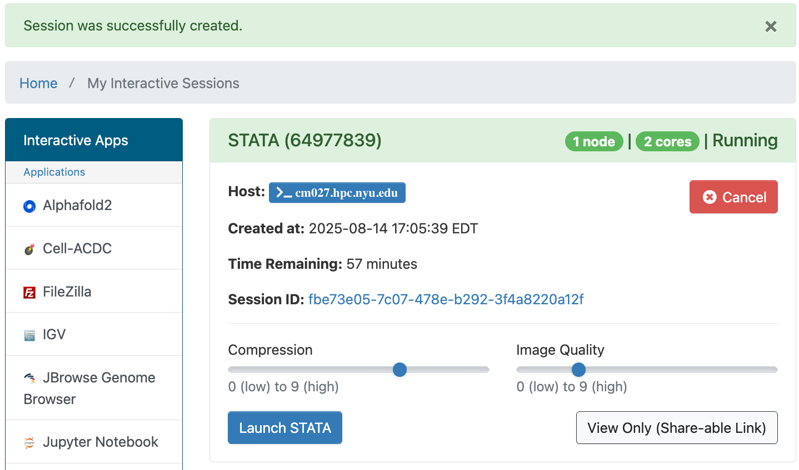
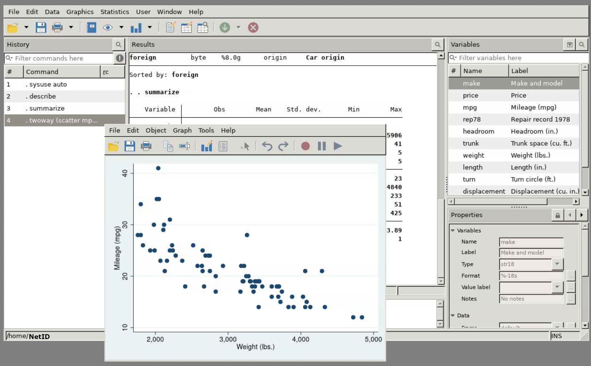

# Stata in OOD

## Getting Started
You can run Stata in OOD by going to the URL [ood.hpc.nyu.edu](http://ood.hpc.nyu.edu) in your browser and selecting `STATA` from the `Interactive Apps` pull-down menu at the top of the page.  Once you've used it and other interactive apps they'll show up on your home screen under the `Recently Used Apps` header.

:::note
Be aware that when you start from `Recently Used Apps` it will start with the same configuration that you used previously.  If you'd like to configure your NGLView Jupyter Notebook session differently, you'll need to select it from the menu.
:::

## Configuration

You can select the Stata version, number or cores, amount of memory, amount of time, and optional Slurm options.



## Stata running in OOD

After you hit the `Launch` button you'll have to wait for the scheduler to find node(s) for you to run on:


Then you'll have a short wait for Stata itself to start up.<br />
Once that happens you'll get one last form that will allow you to:
-   open a terminal window on the compute node your Stata session is running on
-   go to the directory associated with your Session ID that stores output, config and other related files for your session
-   set compression and image quality for your app
-   get a share-able, view only link to your app 



Then after you hit the `Launch STATA` button, your Stata window will be displayed.

### Stata example

Please enter the following commands into the Stata command window and execute them by hitting `enter`:
```
. sysuse auto
. describe
. summarize
. twoway (scatter mpg weight)
```

You should get output like this:

