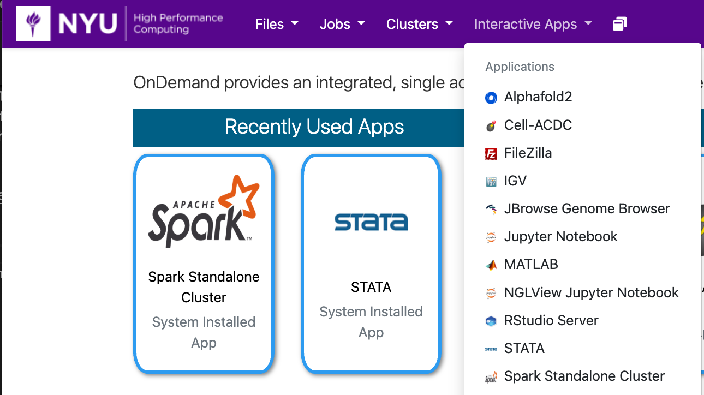
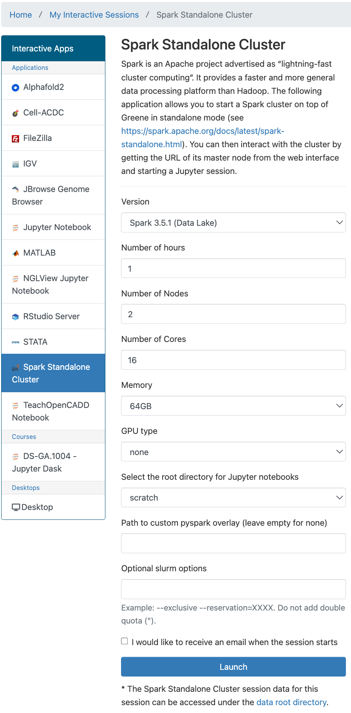
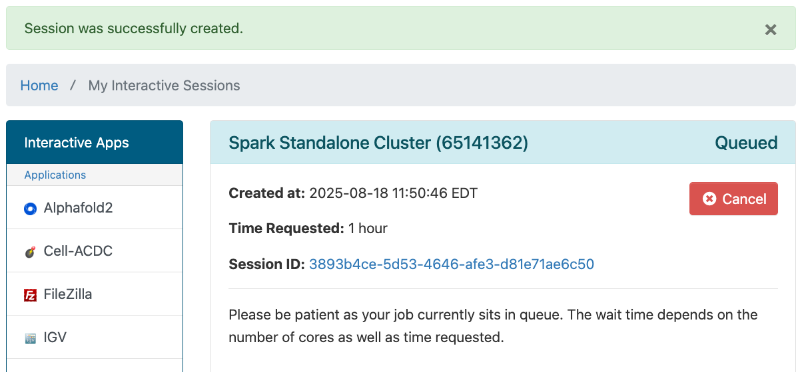
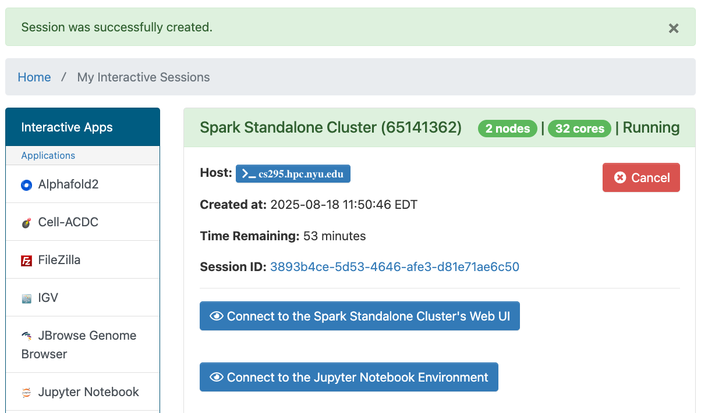

# Spark Standalone Cluster with Jupyter Notebook in OOD

## Getting Started
You can run a Spark Standalone Cluster with Jupyter Notebook in OOD by going to the URL [ood.hpc.nyu.edu](http://ood.hpc.nyu.edu) in your browser and selecting `Spark Standalone Cluster` from the `Interactive Apps` pull-down menu at the top of the page.  As you can see below, once you've used it and other interactive apps they'll show up on your home screen under the `Recently Used Apps` header.

:::note
Be aware that when you start from `Recently Used Apps` it will start with the same configuration that you used previously.  If you'd like to configure your Spark Standalone Cluster with Jupyter Notebook session differently, you'll need to select it from the menu.
:::



## Configuration

You can select the Spark version, amount of time, number of nodes and cores, amount of memory, gpu type (if any), Jupyter notebook root directory, path to custom pyspark overlay (if any), and optional Slurm options.




:::warning
If you select to use `/home` as your root directory be careful not to go over your quota.  You can find your current usage with the `myquota` command.  Please see our [Storage documentation](../03_storage/01_intro_and_data_management.mdx) for details about your storage options.
:::

## Spark Standalone Cluster with Jupyter Notebook running in OOD

After you hit the `Launch` button you'll have to wait for the scheduler to find node(s) for you to run on:


Then you'll have a short wait for Spark itself to start up.<br />
Once that happens you'll get one last page that will give you links to:
-   open a terminal window on the compute node your Spark session is running on
-   go to the directory associated with your Session ID that stores output, config and other related files for your session



Please click the `Connect to the Jupyter Notebook Environment` button and a Jupyter window will open.  Please select to create a new notebook and you're ready to go.

### Spark Standalone Cluster Jupyter Notebook Example

Please enter the following commands into the first cell of your Jupyter notebook and execute them by typing `Shift` and `Enter` at the same time.
```python
from pyspark import SparkContext
import requests

# Create a SparkContext
sc = SparkContext("local", "WordCountExample")

# Get text of Moby Dick from Project Gutenberg
file_url = 'https://www.gutenberg.org/ebooks/2701.txt.utf-8'
try:
    response = requests.get(file_url)
    response.raise_for_status()
except requests.exceptions.RequestException as e:
    print(f"Error during request: {e}")
# Save text to temp file
with open('moby_dick_temp_spark_example.txt', "w") as file:
    file.write(response.text)

# Create an RDD from a text file
lines = sc.textFile("/scratch/rjy1/moby_dick_temp_spark_example.txt")

# FlatMap to split lines into words and convert to lowercase
words = lines.flatMap(lambda line: line.lower().split(" "))

# Map each word to a (word, 1) tuple
word_pairs = words.map(lambda word: (word, 1))

# ReduceByKey to sum the counts for each word
word_counts = word_pairs.reduceByKey(lambda a, b: a + b)

# Collect the results to the driver program
results = word_counts.collect()

# Print the word counts
for word, count in results:
    print(f"{word}: {count}")
```

You should get output like:
```
the: 14512
project: 87
gutenberg: 25
ebook: 8
of: 6682
moby: 81
dick;: 10
or,: 17
whale: 533
: 4318
this: 1277
is: 1601
for: 1555
use: 39
anyone: 5
anywhere: 11
in: 4126
united: 24
states: 13
and: 6321
most: 284
other: 360
parts: 32
world: 79
at: 1310
no: 488
cost: 3
with: 1750
almost: 189
restrictions: 2
whatsoever.: 5
you: 843
may: 227
copy: 15
...
```
etc.
