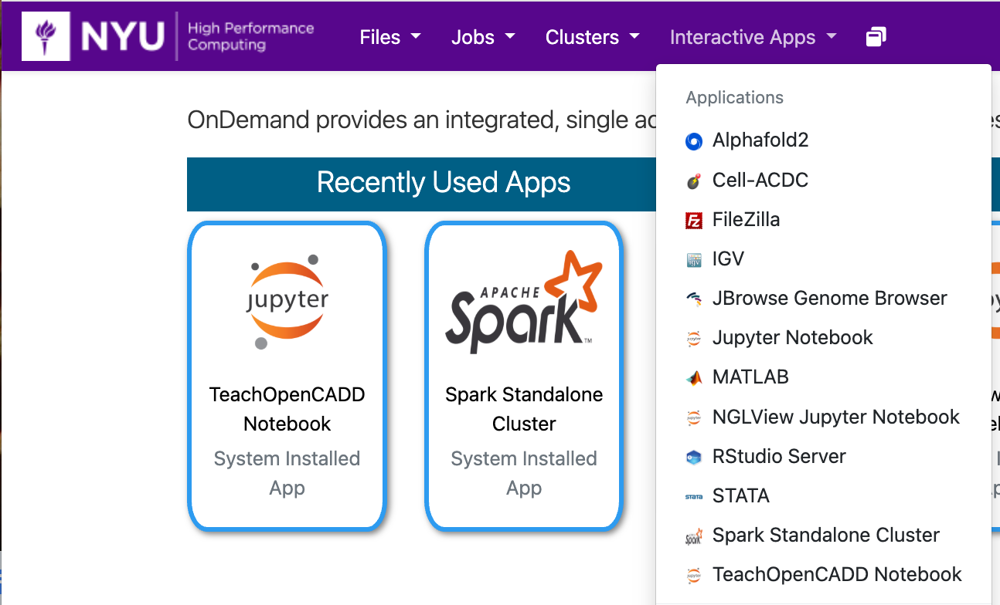
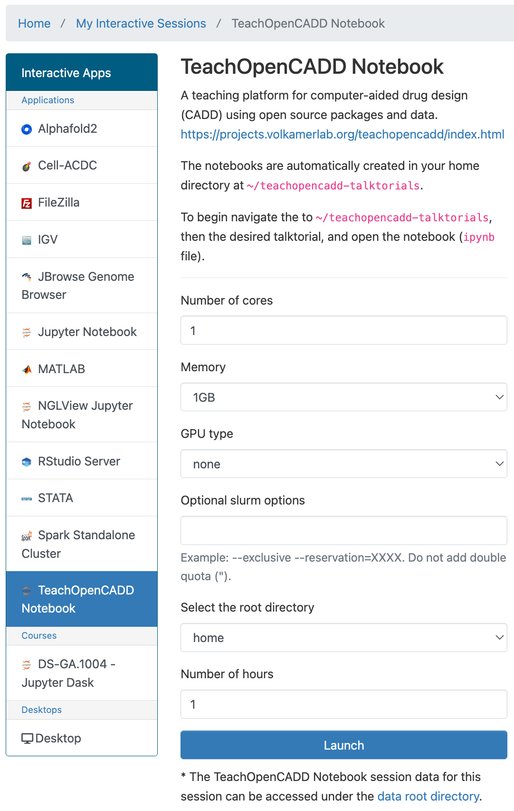
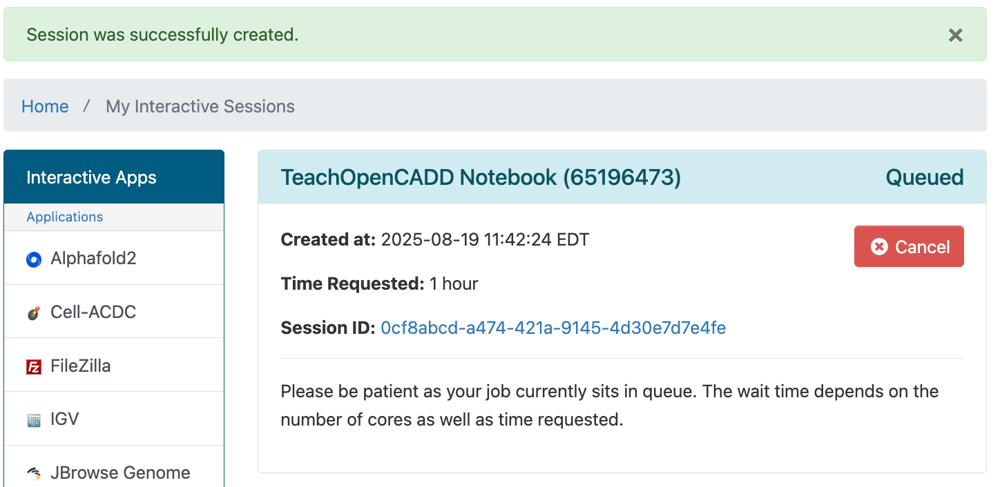
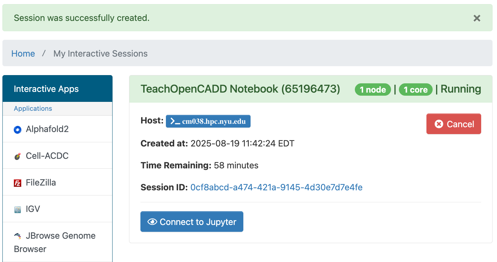

# TeachOpenCADD in Jupyter Notebook in OOD

[TeachOpenCADD](https://projects.volkamerlab.org/teachopencadd/index.html) is a teaching platform for computer-aided drug design.

## Getting Started
You can run TeachOpenCADD with Jupyter Notebook in OOD by going to the URL [ood.hpc.nyu.edu](http://ood.hpc.nyu.edu) in your browser and selecting `TeachOpenCADD` from the `Interactive Apps` pull-down menu at the top of the page.  As you can see below, once you've used it and other interactive apps they'll show up on your home screen under the `Recently Used Apps` header.

:::note
Be aware that when you start from `Recently Used Apps` it will start with the same configuration that you used previously.  If you'd like to configure your TeachOpenCADD session differently, you'll need to select it from the menu.
:::

## Configuration

You can select the number cores, amount of memory, gpu type (if any), optional Slurm options, root directory, and number of hours.

:::warning
If you select to use `/home` as your root directory be careful not to go over your quota.  You can find your current usage with the `myquota` command.  Please see our [Storage documentation](../03_storage/01_intro_and_data_management.mdx) for details about your storage options.
:::

## Spark Standalone Cluster with Jupyter Notebook running in OOD

After you hit the `Launch` button you'll have to wait for the scheduler to find node(s)for you to run on:

Then you'll have a short wait for Spark itself to start up. 
Once that happens you'll get one last page that will give you links to:
-   open a terminal window on the compute node your Spark session is running on
-   go to the directory associated with your Session ID that stores output, config and other related files for your session

Please click the `Connect to Jupyter` button and a Jupyter window will open.

Navigate to the `/teachopencadd-talktorials` directory and select your desired tutorial.
